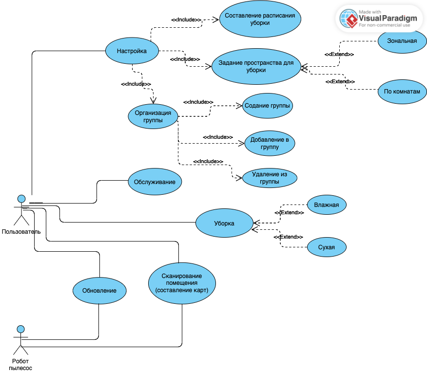
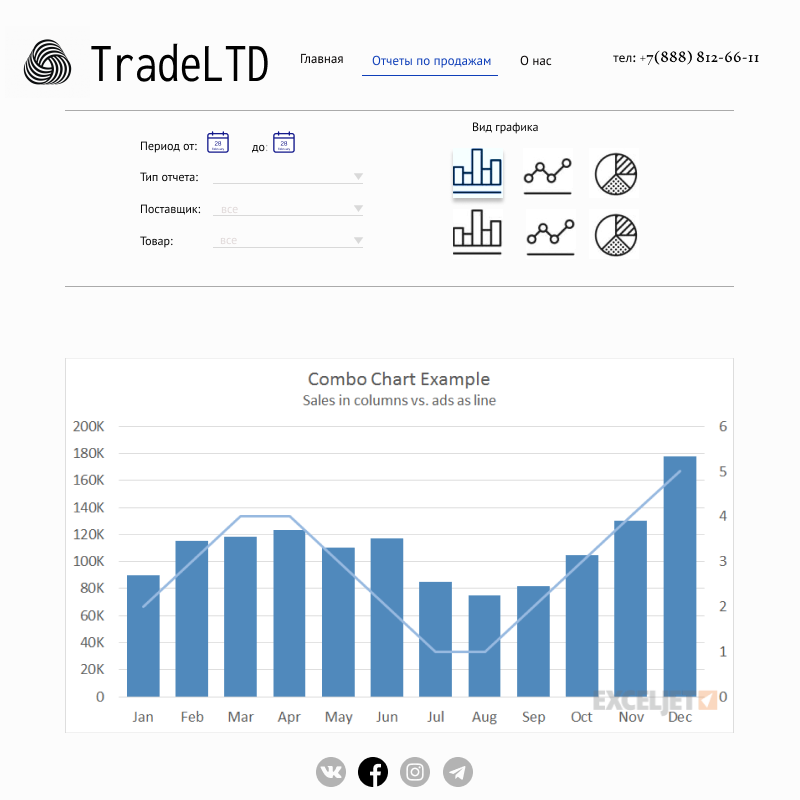

## Урок 10. Структура приложения с пользовательским интерфейсом и базой данных (паттерн Repository)

### Use case диаграмма

### Диаграмма ERD домена приложения

### Интерфейс для заказа ресурсов в облачном сервисе

