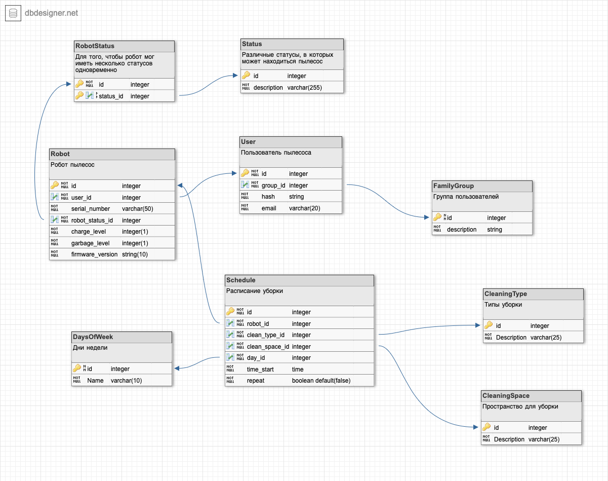

## Урок 8. Типы архитектур прикладных приложений (мобильные): MVC, MVP, MVVM.

### Диаграмма ERD домена приложения

### Экранные формы интерфейса

Стартовый экран

Экран выбора столика

Экран подтверждения брони

### Алгоритма взамодействия MVP

